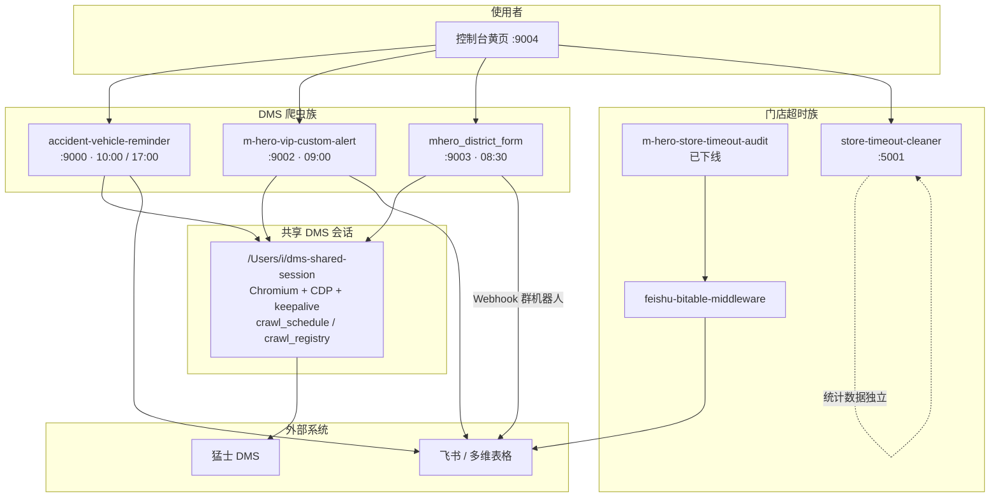

# 猛士服务运营（m-hero）工具集

本目录汇总猛士科技服务运营侧的内部工具：DMS 爬虫、飞书通知、区域报表、超时机器人统计、企微 SCRM OpenAPI 文档，以及统一黄页入口。

> 各业务仍是**独立 Git 仓库**；本仓库（`m-hero`）提供文档地图、依赖关系与部署总览。代码以子目录方式并列检出。

## 文档地图

| 文档 | 说明 |
|------|------|
| [AGENTS.md](AGENTS.md) | **AI Agent 开工说明**（约束、速查、时刻表摘要） |
| [本页](README.md) | 总览、入口表、依赖关系 |
| [docs/DEPENDENCIES.md](docs/DEPENDENCIES.md) | 项目依赖与数据流（详细） |
| [docs/SHARED_DMS_BROWSER.md](docs/SHARED_DMS_BROWSER.md) | 共享 Chromium、**爬取时刻表**、强刷保护（权威说明） |
| [docs/DEPLOYMENT.md](docs/DEPLOYMENT.md) | 本机端口、launchd / tunnel（不含公网域名） |

### 各项目文档入口

| 项目 | README | 补充文档 |
|------|--------|----------|
| [accident-vehicle-reminder](https://github.com/kaisonlau8/accident-vehicle-reminder) | [README](accident-vehicle-reminder/README.md) | [运维](accident-vehicle-reminder/docs/operations.md) · [共享浏览器](accident-vehicle-reminder/docs/shared-browser-session.md) |
| [m-hero-vip-custom-alert](https://github.com/kaisonlau8/m-hero-vip-custom-alert) | [README](m-hero-vip-custom-alert/README.md) | [部署](m-hero-vip-custom-alert/docs/deploy-mac-studio.md) · [共享浏览器](m-hero-vip-custom-alert/docs/shared-browser-session.md) |
| [mhero_district_form](https://github.com/kaisonlau8/mhero_district_form) | [README](mhero_district_form/README.md) | [使用](mhero_district_form/docs/usage.md) · [开发](mhero_district_form/docs/development.md) |
| [m-hero-store-timeout-audit](https://github.com/kaisonlau8/m-hero-store-timeout-audit) | [README](m-hero-store-timeout-audit/README.md) | **已下线** |
| [store-timeout-cleaner](https://github.com/kaisonlau8/store-timeout-cleaner) | [README](store-timeout-cleaner/README.md) | — |
| [m-hero-hub](https://github.com/kaisonlau8/m-hero-hub) | [README](m-hero-hub/README.md) | — |
| [scrm-api](https://github.com/kaisonlau8/scrm-api) | [README](scrm-api/README.md) | [定开](scrm-api/docs/custom-openapi.md) · [基线](scrm-api/docs/baseline-openapi.md) |
| feishu-bitable-middleware（软链） | 见原仓库 | 原门店审计依赖的本地中间件包 |

## 控制台入口（仅本地）

公网域名经 Cloudflare Tunnel 配置，**不写入本仓库**。本地默认：

| 系统 | 本地 | 仓库 |
|------|------|------|
| 事故车提醒 | `http://127.0.0.1:9000` | accident-vehicle-reminder |
| VIP 保养提醒 | `http://127.0.0.1:9002` | m-hero-vip-custom-alert |
| 区域报表 | `http://127.0.0.1:9003` | mhero_district_form |
| 超时机器人统计 | `http://127.0.0.1:5001` | store-timeout-cleaner |
| 控制台黄页 | `http://127.0.0.1:9004` | m-hero-hub |

## 项目依赖关系（简图）



要点：

1. **事故车 / VIP / 区域报表** 共用一套 Playwright Chromium 与保活强刷；由时刻表 + 爬取登记保护，避免强刷打断导出。详见 [SHARED_DMS_BROWSER.md](docs/SHARED_DMS_BROWSER.md)。
2. **门店超时审计** 已于 2026-08-13 下线（原 `:3001` / pm2 `store-audit`）；代码仓保留，不再跑服务。
3. **超时机器人统计** 为独立 Flask 解析/统计控制台，不爬 DMS。
4. **黄页** 只做入口聚合与本地探活，无业务数据依赖。
5. **scrm-api** 是企微 SCRM 生产 OpenAPI 文档仓，无本地 HTTP 服务；凭证只放该仓 `.env`。

更细的依赖说明见 [docs/DEPENDENCIES.md](docs/DEPENDENCIES.md)。

## 本机目录约定

```text
/Users/i/myCode/m-hero/
  README.md                 # 本文件
  docs/                     # 总文档
  accident-vehicle-reminder/
  m-hero-vip-custom-alert/
  mhero_district_form/
  m-hero-store-timeout-audit/
  store-timeout-cleaner/
  m-hero-hub/
  scrm-api/
  feishu-bitable-middleware -> ../feishu-bitable-middleware

/Users/i/dms-shared-session/   # 共享浏览器会话（不进 Git）
```

## 检出各仓库

```bash
mkdir -p ~/myCode/m-hero && cd ~/myCode/m-hero
git clone https://github.com/kaisonlau8/m-hero.git .
# 或仅拉文档后，再并列 clone 各业务仓：
git clone https://github.com/kaisonlau8/accident-vehicle-reminder.git
git clone https://github.com/kaisonlau8/m-hero-vip-custom-alert.git
git clone https://github.com/kaisonlau8/mhero_district_form.git
git clone https://github.com/kaisonlau8/m-hero-store-timeout-audit.git
git clone https://github.com/kaisonlau8/store-timeout-cleaner.git
git clone https://github.com/kaisonlau8/m-hero-hub.git
git clone https://github.com/kaisonlau8/scrm-api.git
```
